# waveshare-genui

A toolkit for driving the [Waveshare ESP32-P4-WIFI6-Touch-LCD-4B](https://www.waveshare.com/esp32-p4-touch-lcd-4b.htm) 720×720 IPS display.

| Reading files | Test results | Bug fix |
|:---:|:---:|:---:|
| 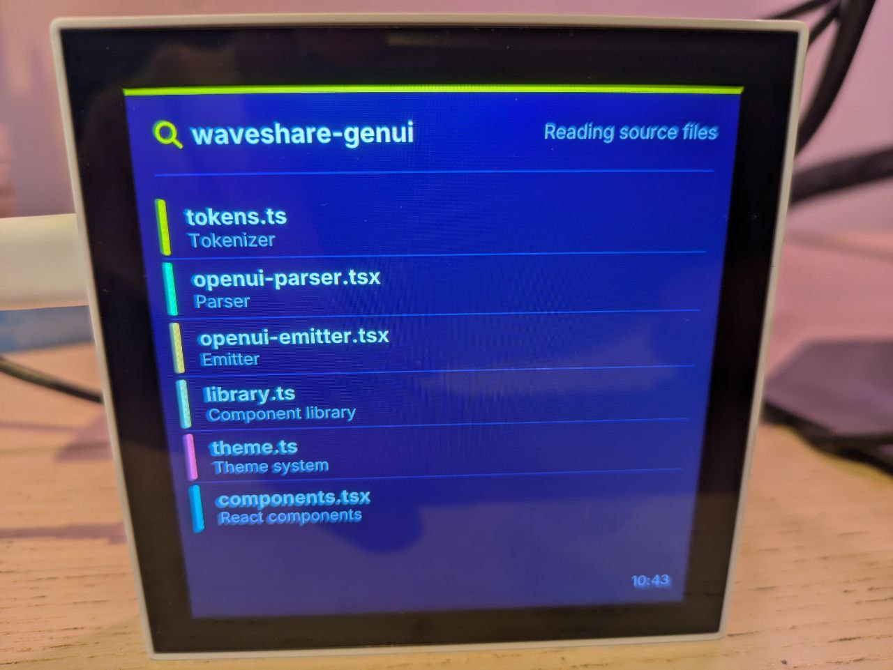 | 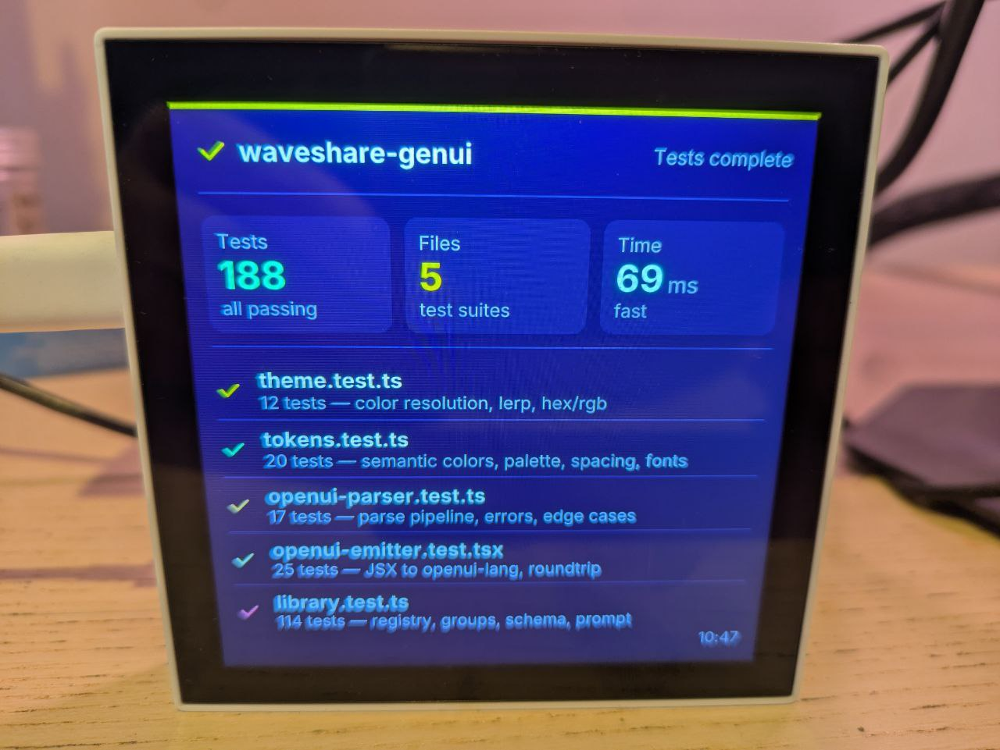 | 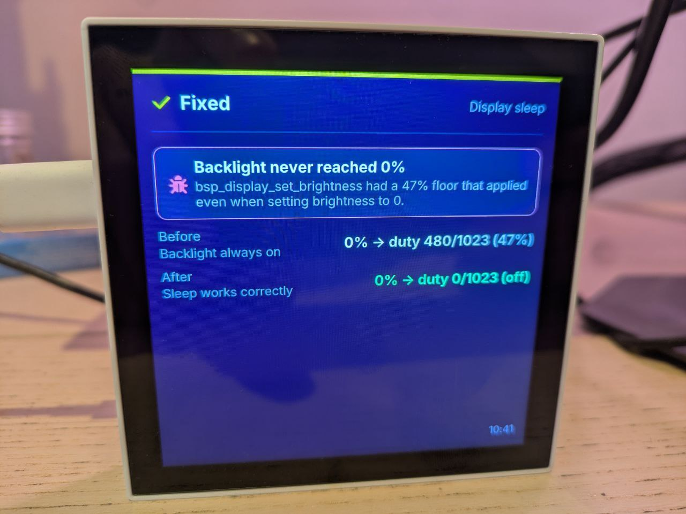 |

---

## Firmware

Rust application targeting the ESP32-P4 via `esp-idf-sys`. Receives WebP-encoded frames over UART, decodes them, converts to RGB565, and writes to the MIPI DSI framebuffer.

### Features

- **Priority scheduling** — three levels (`low`, `normal`, `high`). Higher priority frames preempt lower ones; each level has a minimum display hold time (1s, 3s, 5s).
- **Automatic sleep** — backlight turns off after 60s of no serial activity, wakes on the next received byte.
- **Power commands** — the host can explicitly turn the display on or off.

### Serial protocol

WebP frames over UART at 921600 baud:

```
Frame:    "DWBP" (4B) + data_len (u32 LE) + chunk_size (u16 LE) + priority (u8) + reserved (u8)
Flow:     header → ACK → [chunk → ACK]... → final ACK
Command:  "DCMD" + cmd (u8) → ACK    (0x00 = off, 0x01 = on)
```

### Hardware

| Feature | Detail |
|---------|--------|
| MCU | ESP32-P4 (dual-core RISC-V, 360 MHz) |
| Display | 4" 720×720 IPS, MIPI DSI (ST7703) |
| PSRAM | 32 MB @ 200 MHz |
| Connection | Single USB cable (CH343 USB-to-UART bridge) |

### Building

```bash
cd firmware && nix develop path:.. --command make flash
```

### Source layout

```
firmware/src/main.rs           Frame receiver, priority scheduler, sleep logic
firmware/components/bsp/       Board support: display init, UART, backlight PWM
```

---

## CLI

Node/Bun command-line tool that bridges the UI library and the display. It parses openui-lang input, rasterizes it to a WebP image, and sends it over serial.

### Rasterization pipeline

```
openui-lang → React element tree → SVG (satori/yoga) → PNG (resvg) → WebP (sharp, rotated 180°) → UART
```

### Usage

```bash
# Pipe openui-lang to the display
bun run examples/clock.tsx | waveshare-genui -

# Render to PNG instead of sending
bun run examples/stocks.tsx AAPL MSFT | waveshare-genui - -o stocks.png

# Read an .oui file
waveshare-genui dashboard.oui

# Generate the LLM system prompt
waveshare-genui prompt

# Generate the JSON schema
waveshare-genui schema

# Display power control
waveshare-genui on
waveshare-genui off
```

### Options

| Flag | Description |
|------|-------------|
| `-p, --port <path>` | Serial port (default: `/dev/ttyACM0`) |
| `-o, --output <file>` | Write PNG instead of sending to display |
| `--priority <level>` | Frame priority: `low`, `normal`, `high` |
| `--theme <file>` | Base16 theme JSON |
| `--rotate <degrees>` | Output rotation (default: `180`) |

### Source layout

```
genui/src/index.tsx       CLI entry point, argument parsing
genui/src/rasterizer.ts   satori → resvg → sharp pipeline
genui/src/serial.ts       DWBP chunked serial protocol
genui/src/theme.ts        Base16 theme loading
```

---

## UI Library

A component library built on [`@openuidev/react-lang`](https://github.com/thesysdev/openui). UIs can be authored as **JSX** or **[openui-lang](https://www.openui.com/docs/openui-lang)** — both produce the same output.

Each component is defined with a Zod schema (which sets positional argument order for openui-lang) and a satori-compatible React renderer. The library also generates LLM system prompts so models can output valid openui-lang directly.

### Source layout

```
genui/src/tokens.ts              Design tokens (single UI export)
genui/src/components/            One file per component
  helpers.tsx                    Shared schemas, iconStyle, utilities
  layout/                       Canvas, Header, Content, Stack, Card, Separator, Spacer
  content/                      Text, Icon, Badge, Alert, EmptyState, Timestamp, CodeBlock
  data/                         Table, List, KeyValue, Stat, Steps, Tags
  viz/                          Gauge, ProgressBar, Sparkline, StatusDot
  media/                        QRCode, Image
genui/src/components.tsx         Barrel exports
genui/src/library.ts             Library assembly, component groups, prompt config
genui/src/openui-parser.tsx      openui-lang text → React element tree
genui/src/openui-emitter.tsx     JSX → openui-lang text
```

### Authoring with openui-lang

```
root = Canvas([header, content, ts])
header = Header("\uf201", "Market")
content = Content([card1, card2], "sm")
card1 = Card([row1, spark1])
row1 = Stack([sym, price], "row", "sm", "center", "between")
sym = Text("AAPL", "md", "bold", "muted")
price = Text("$178.52", "lg", "bold")
spark1 = Sparkline([170, 172, 175, 173, 178], "green")
card2 = Card([Text("MSFT — $415.80", "lg", "bold")])
ts = Timestamp()
```

### Authoring with JSX

```tsx
import { emit } from "./src/openui-emitter";
import { Canvas, Header, Content, List, ListItem, Timestamp } from "./src/components";

emit(
  <Canvas>
    <Header icon={"\uf201"} title="Market" />
    <Content>
      <List items={[
        <ListItem text="AAPL" secondary="$178.52" icon={"\uf201"} />,
        <ListItem text="MSFT" secondary="$415.80" icon={"\uf201"} />,
      ]} />
    </Content>
    <Timestamp />
  </Canvas>,
);
```

### Components

30 components across five groups.

#### Layout

`Canvas` · `Header` · `Content` · `Stack` · `Card` · `Separator` · `Spacer`

| Header | Stack | Card |
|:---:|:---:|:---:|
|  | 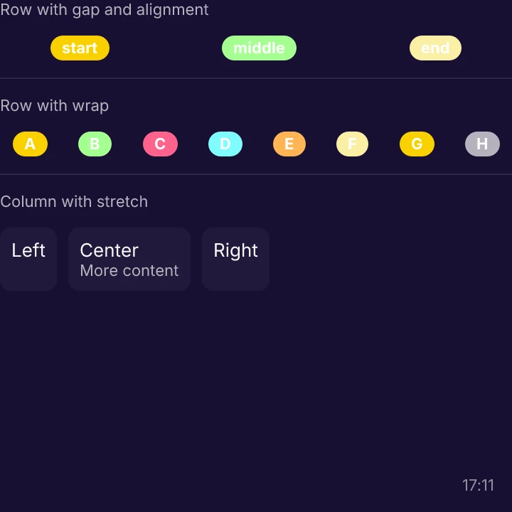 | 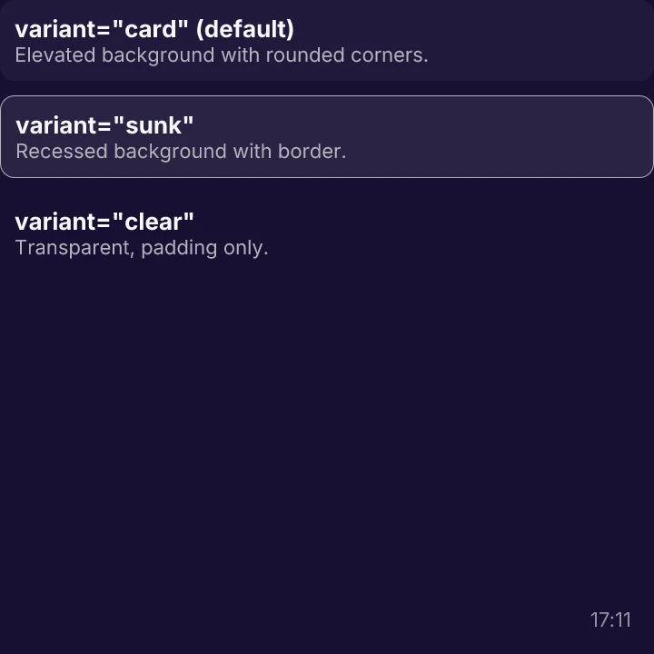 |

#### Content

`Text` · `Icon` · `Badge` · `CodeBlock` · `Alert` · `EmptyState` · `Timestamp`

| Text | Badge & Icon | CodeBlock |
|:---:|:---:|:---:|
| 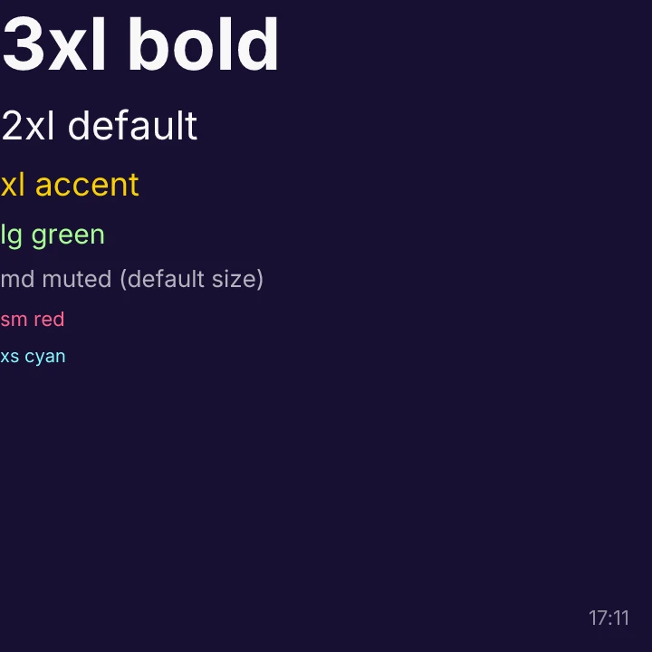 | 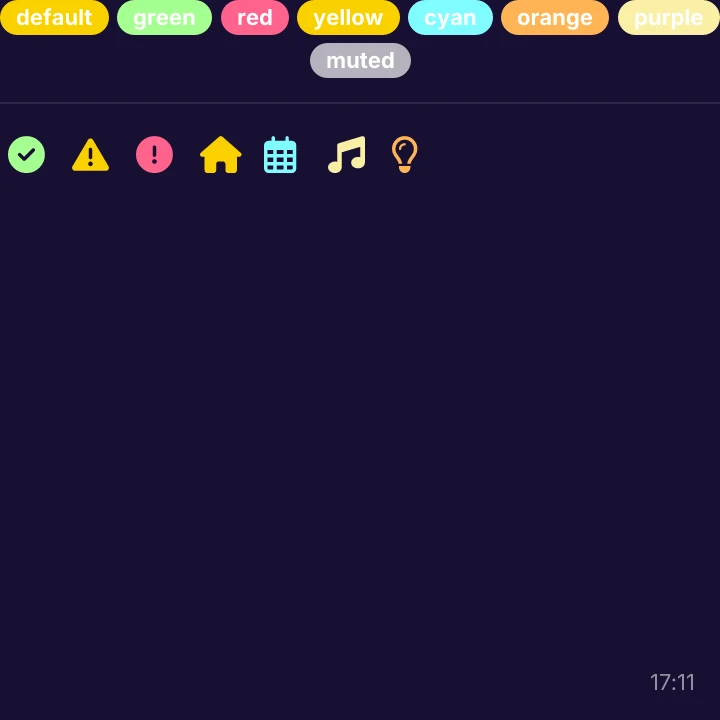 | 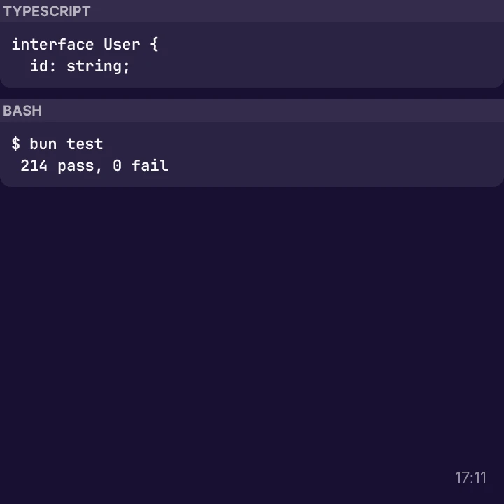 |

| Alert | EmptyState |
|:---:|:---:|
| 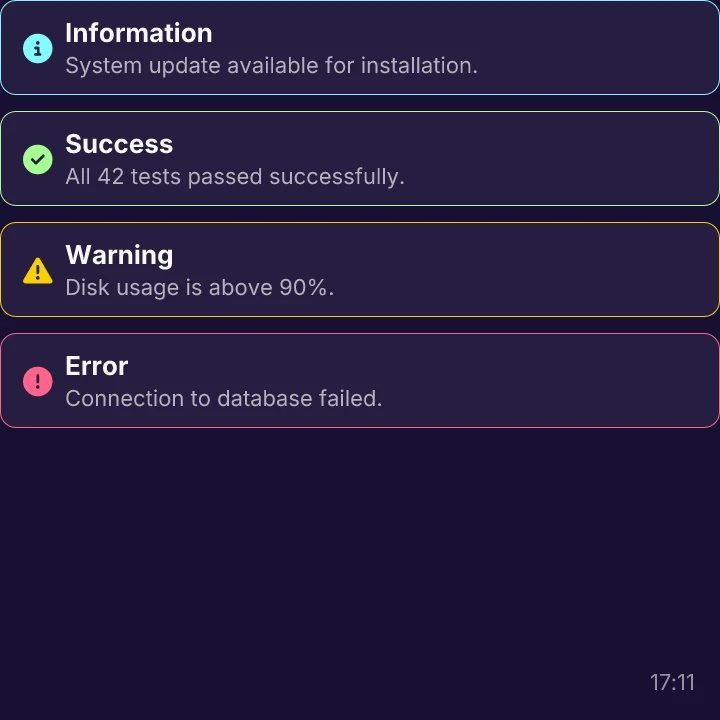 | 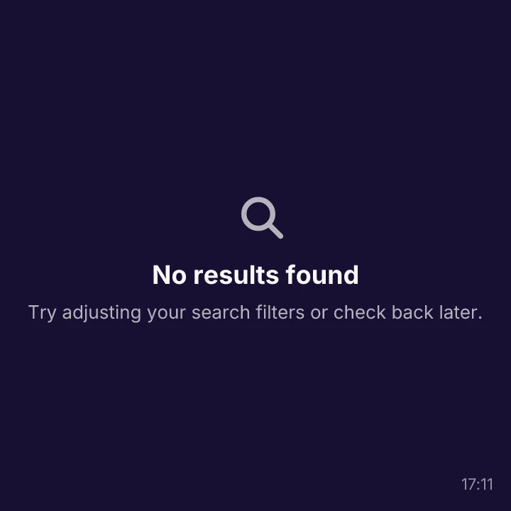 |

#### Data Display

`Table` · `Col` · `List` · `ListItem` · `KeyValue` · `Stat` · `Steps` · `StepsItem` · `TagBlock` · `Tag`

| Table | List | KeyValue |
|:---:|:---:|:---:|
| 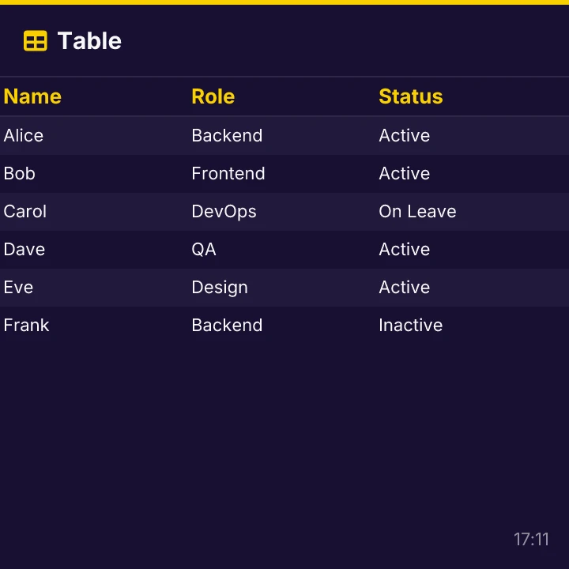 | 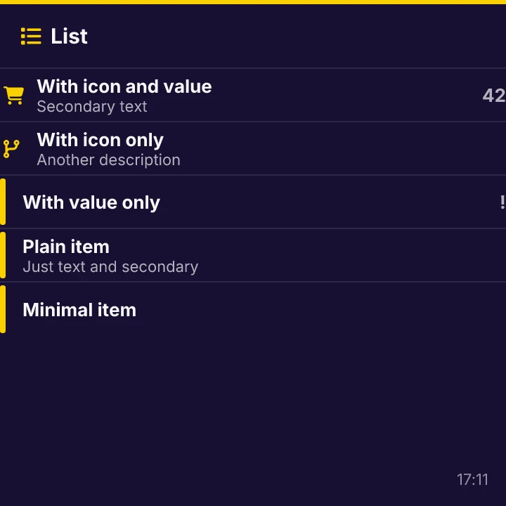 | 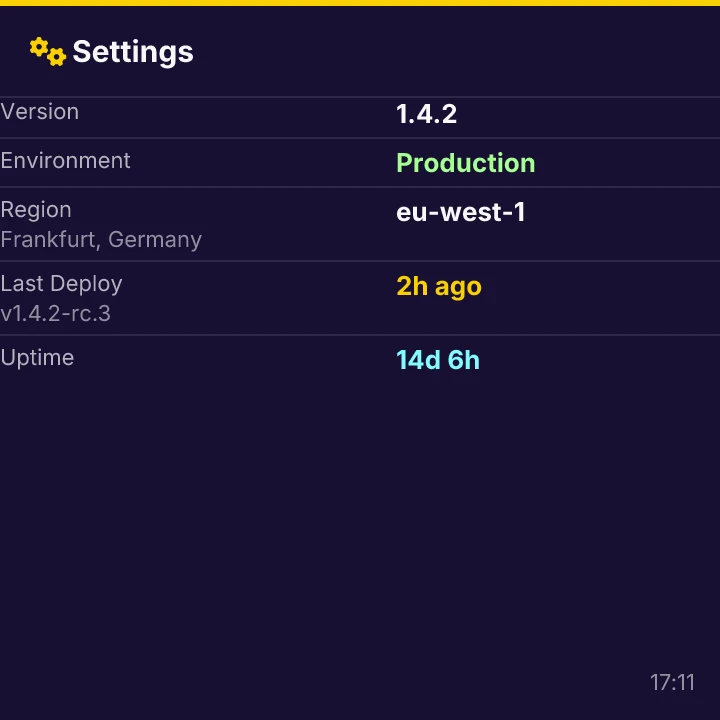 |

| Stat | Steps | TagBlock |
|:---:|:---:|:---:|
| 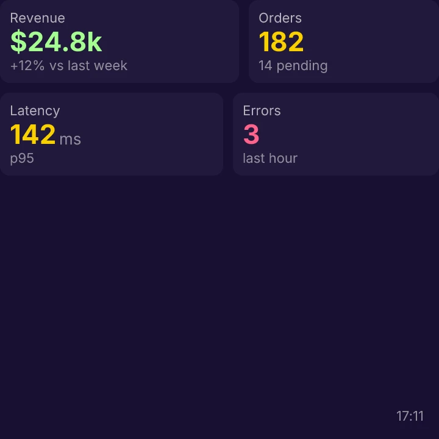 | 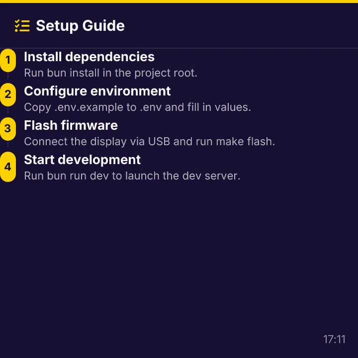 | 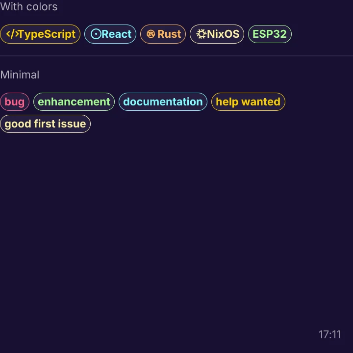 |

#### Data Visualization

`Gauge` · `ProgressBar` · `Sparkline` · `StatusDot`

| Gauge | ProgressBar | Sparkline |
|:---:|:---:|:---:|
| 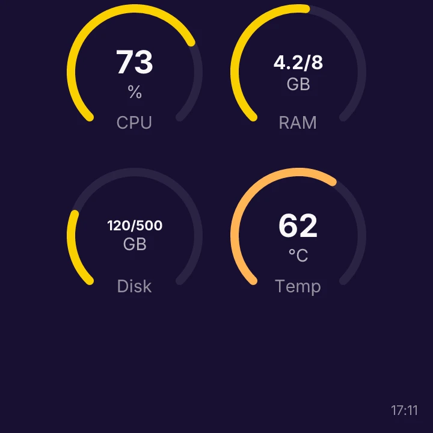 | 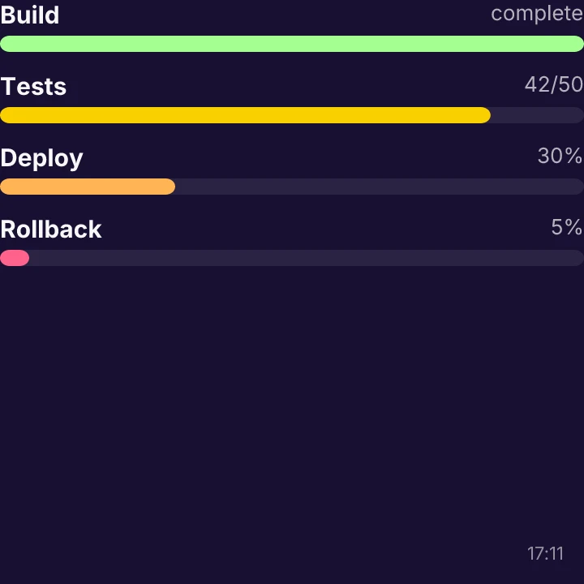 | 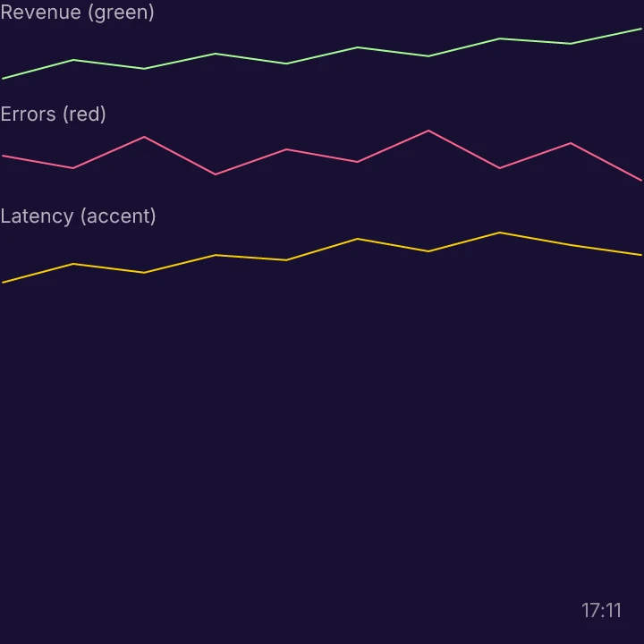 |

| StatusDot |
|:---:|
| 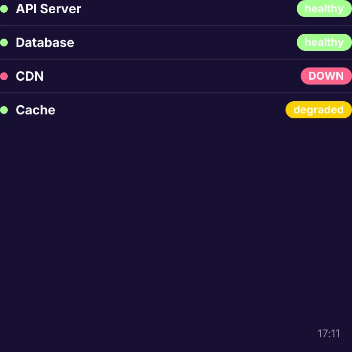 |

#### Media

`QRCode` · `Image`

| QRCode | Image |
|:---:|:---:|
|  | 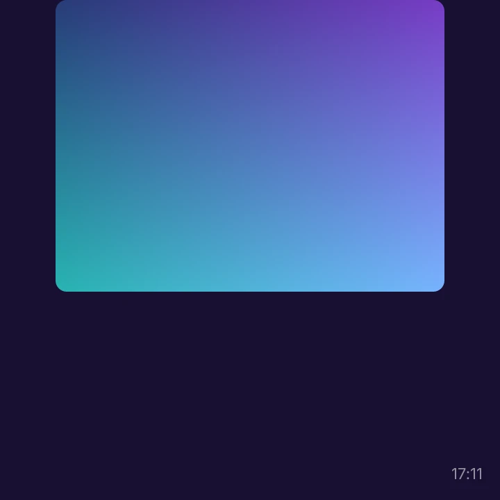 |

### Installing

```bash
cd genui && bun install
```

### Regenerating component screenshots

```bash
cd genui && bun run screenshots
```

---

## License

MIT
