# Waveshare Display

Rust firmware for the **Waveshare ESP32-P4-WIFI6-Touch-LCD-4B** that turns it into a serial-connected display. A host computer sends WebP images over UART and the firmware decodes and renders them on the 720×720 IPS LCD.

## Hardware

| Feature | Detail |
|---------|--------|
| MCU | ESP32-P4 (dual-core RISC-V, 360 MHz) |
| Display | 4" 720×720 IPS, MIPI DSI (ST7703) |
| PSRAM | 32 MB @ 200 MHz |
| Connection | Single USB cable (CH343 USB-to-UART bridge) |
| Touch | GT911 capacitive (not used by this firmware) |

## Screenshots

| | | |
|:---:|:---:|:---:|
| 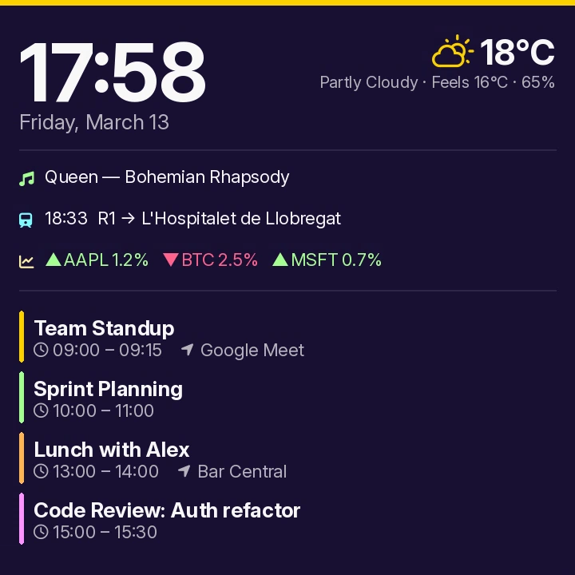 |  | 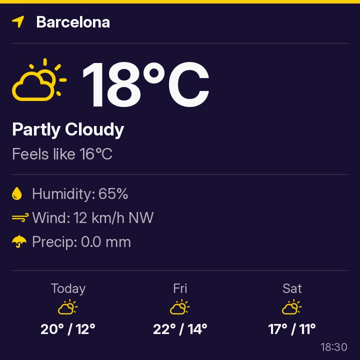 |
| Dashboard | Clock | Weather |
| 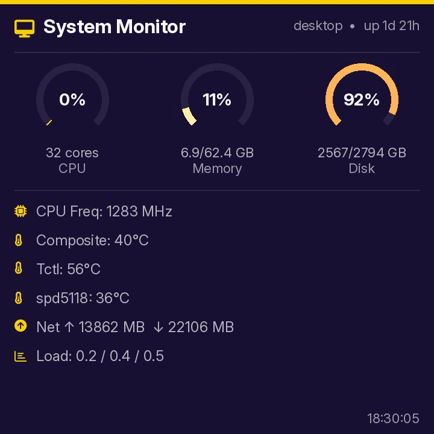 | 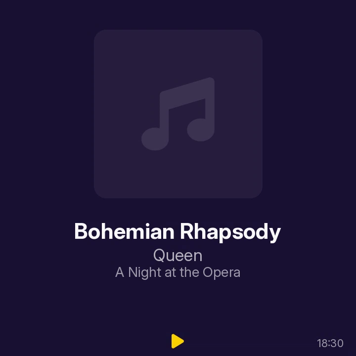 | 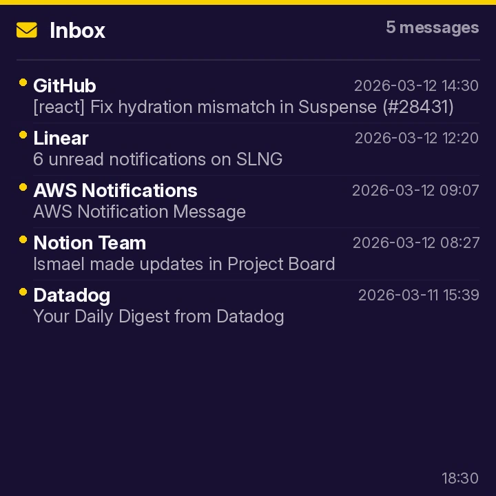 |
| System Monitor | Now Playing | Mail |
|  |  |  |
| Calendar | Tasks | GitHub |
|  |  |  |
| Stocks | Hacker News | Departures |
|  | 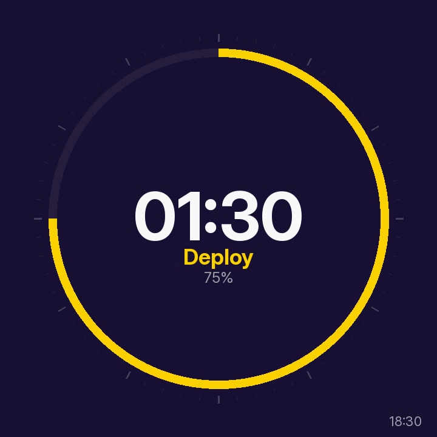 |  |
| Monitor | Timer | Gauge |
| 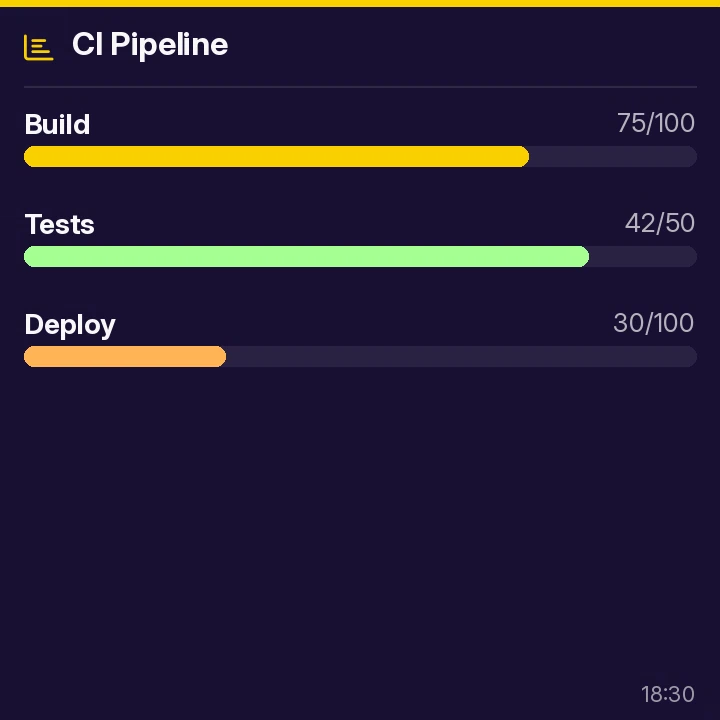 | 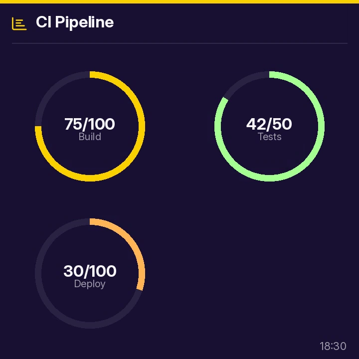 | 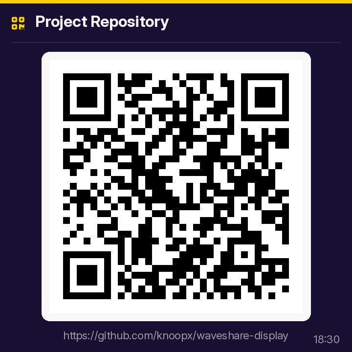 |
| Progress Bar | Progress Ring | QR Code |
| 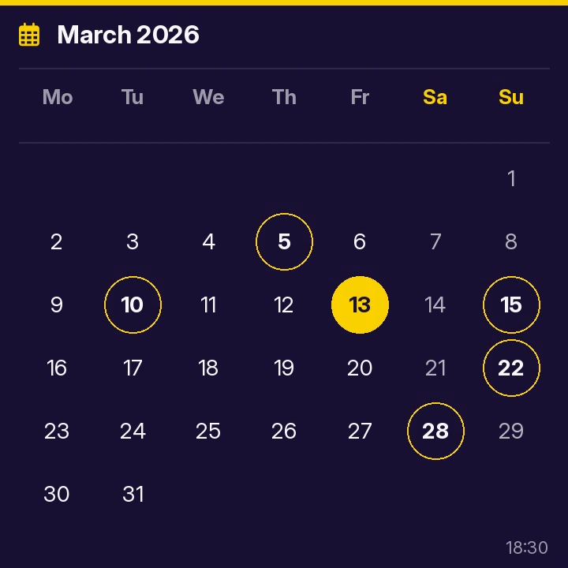 |  |  |
| Month Calendar | Notification | Message |
|  |  | 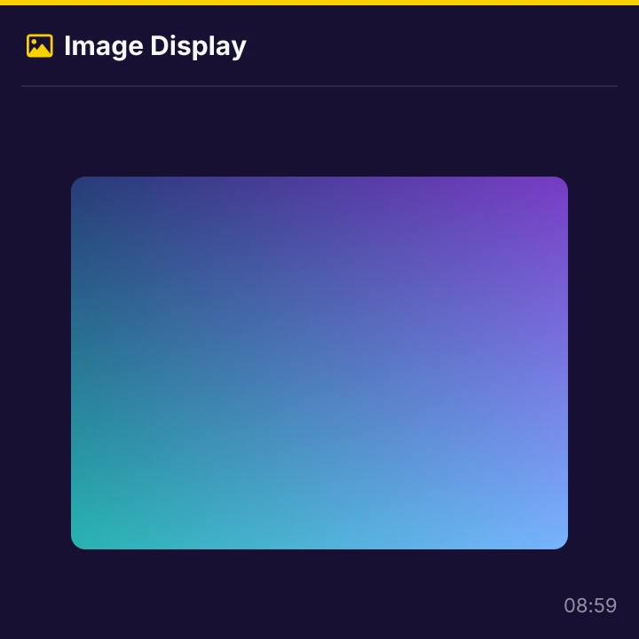 |
| Table | List | Image |

## Host CLI

A single `waveshare-display` command with subcommands. All are one-shot — send a single frame and exit. Orchestrate externally with `watch`, cron, or a wrapper script.

```
waveshare-display [--port PORT] <subcommand> [options]
```

Default port: `/dev/ttyACM0`. Override with `--port` / `-p`.

| Subcommand | Example | Description |
|------------|---------|-------------|
| **dashboard** | `waveshare-display dashboard --symbol AAPL --station-id 79600` | Clock + weather + events + stocks + train + now playing |
| **image** | `waveshare-display image photo.jpg` | Send image or directory |
| **message** | `waveshare-display message "Hello" --size 64` | Fullscreen text |
| **notify** | `waveshare-display notify "Title" "Body" --icon $'\uf058' --accent green` | Notification with Nerd Font icon |
| **clock** | `waveshare-display clock --24h` | Current time and date |
| **weather** | `waveshare-display weather --location Barcelona` | Weather via wttr.in |
| **sysmon** | `waveshare-display sysmon` | CPU, RAM, disk gauges + details |
| **nowplaying** | `waveshare-display nowplaying` | MPRIS media info via playerctl |
| **mail** | `waveshare-display mail` | Unread emails via gog CLI |
| **calendar** | `waveshare-display calendar` | Today's events via gog CLI |
| **github** | `waveshare-display github owner/repo [...]` | Repo stars, forks, issues (up to 4) |
| **timer** | `waveshare-display timer --remaining 90 --total 120 --label Deploy` | Countdown ring |
| **gauge** | `waveshare-display gauge -g "CPU:73:%" -g "RAM:4/8:GB"` | 1–4 arc gauges |
| **qrcode** | `waveshare-display qrcode "https://..." --label Title` | QR code display |
| **progress** | `waveshare-display progress -i "Build:75:100" -i "Test:90%" --style bar` | Progress bars or circles |
| **table** | `waveshare-display table --json '[{"Name":"Alice","Score":"95"}]'` | Tabular data display |
| **list** | `waveshare-display list -i "Buy milk:From store" --title "To Do"` | List with icons and secondary text |
| **departures** | `waveshare-display departures --station "My Station" --station-id 12345` | Train departure board (Rodalies API) |
| **stocks** | `waveshare-display stocks AAPL MSFT BTC-USD` | Stock/crypto ticker via Yahoo Finance |
| **hackernews** | `waveshare-display hackernews --count 8` | Hacker News top stories |
| **monitor** | `waveshare-display monitor -s "App=https://example.com"` | Site uptime monitor |
| **monthcal** | `waveshare-display monthcal --highlight 15 --highlight 20` | Month calendar grid |

All subcommands support `--fg`, `--bg`, `--accent` color customization (name or `#RRGGBB`).

## Protocol

WebP-compressed frames are sent over UART at 921600 baud using a chunked protocol with flow control:

```
Header (12 bytes):
  Offset  Size  Field
  0       4     Magic: "DWBP" (ASCII)
  4       4     WebP data length (u32 LE)
  8       2     Chunk size (u16 LE, typically 4096)
  10      2     Reserved (set to 0)

Flow:
  Host → Device: header
  Device → Host: 0x01 (ACK)
  For each chunk:
    Host → Device: chunk bytes
    Device → Host: 0x01 (ACK)
  Device decodes WebP, blits to framebuffer
  Device → Host: 0x01 (done)
```

## Build

### Prerequisites

- [Nix](https://nixos.org/) with flakes enabled
- ESP-IDF v5.4 toolchain (auto-downloaded by `esp-idf-sys` on first build)

### Compile and flash

```bash
nix develop path:. --command make flash
```

### Run

```bash
# Via nix run (default port /dev/ttyACM0)
nix run path:. -- clock --24h

# In dev shell
nix develop path:.
waveshare-display clock --24h
waveshare-display sysmon
waveshare-display image photo.jpg

# Custom port
waveshare-display -p /dev/ttyUSB0 clock --24h
```

## Architecture

```
Host (Python)                    ESP32-P4
┌────────────────┐    UART      ┌──────────────────┐
│ waveshare-     │ ── DWBP ───→ │ main.rs          │
│   display      │ ←── ACK ──── │  ↓ WebP decode   │
│ render → WebP  │              │  ↓ RGB565 convert│
└────────────────┘              │  ↓ blit to FB    │
                                │  ↓ cache flush   │
                                │ MIPI DSI → LCD   │
                                └──────────────────┘
```

- **`components/bsp/`** — C component: MIPI DSI display init (ST7703 vendor commands), UART driver
- **`src/main.rs`** — Rust: WebP decoding, RGB565 conversion, framebuffer blit, chunked protocol
- **`host/`** — Python: `display.py` (protocol), `widgets.py` (render functions), `waveshare_display.py` (CLI)
- **`scripts/`** — Screenshot generation
- **`flake.nix`** — Nix flake: dev shell, CLI package, flash app

## Performance

| Metric | Value |
|--------|-------|
| Frame size (raw) | 1012 KB (720×720 RGB565) |
| Typical WebP size | 5–60 KB |
| Transfer time | 0.1–0.7s per frame |
| Compression ratio | 15–200× vs raw |

## License

MIT
