# waveshare-genui

Rust firmware + generative UI toolkit for the **Waveshare ESP32-P4-WIFI6-Touch-LCD-4B**. Write display UIs as JSX or [openui-lang](https://github.com/thesysdev/openui), render to images, and send over serial to the 720×720 IPS LCD.

## Hardware

| Feature | Detail |
|---------|--------|
| MCU | ESP32-P4 (dual-core RISC-V, 360 MHz) |
| Display | 4" 720×720 IPS, MIPI DSI (ST7703) |
| PSRAM | 32 MB @ 200 MHz |
| Connection | Single USB cable (CH343 USB-to-UART bridge) |

## Screenshots

| | | |
|:---:|:---:|:---:|
| 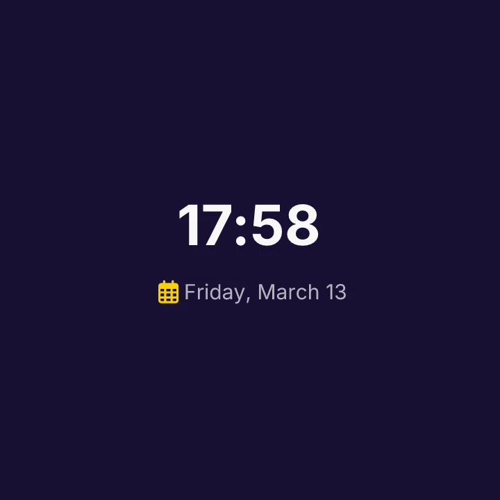 | 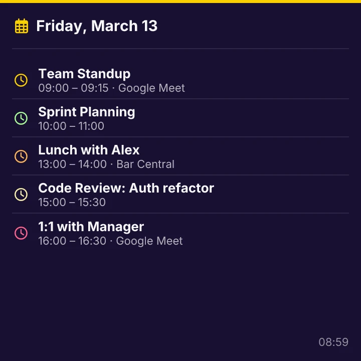 | 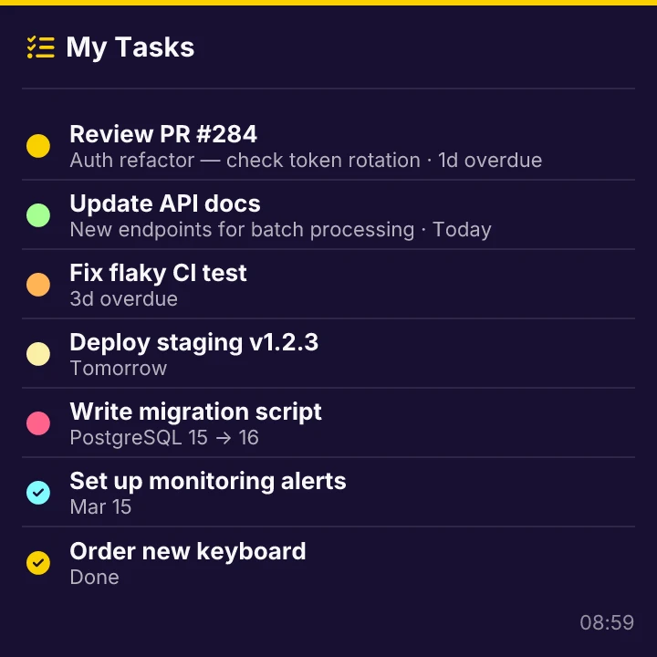 |
| Clock | Calendar | Tasks |
| 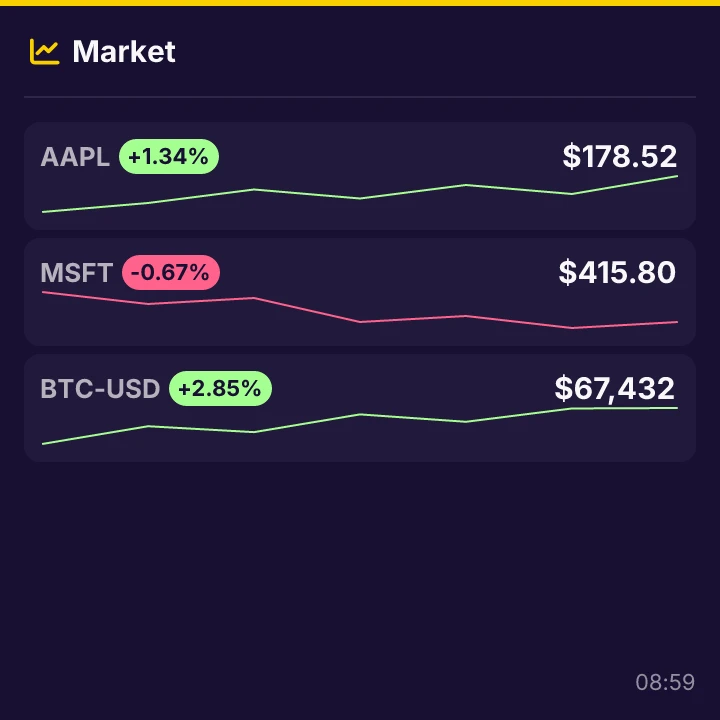 | 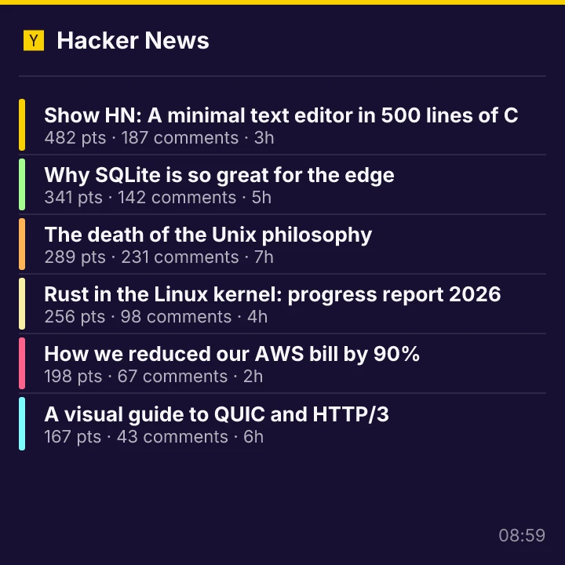 | 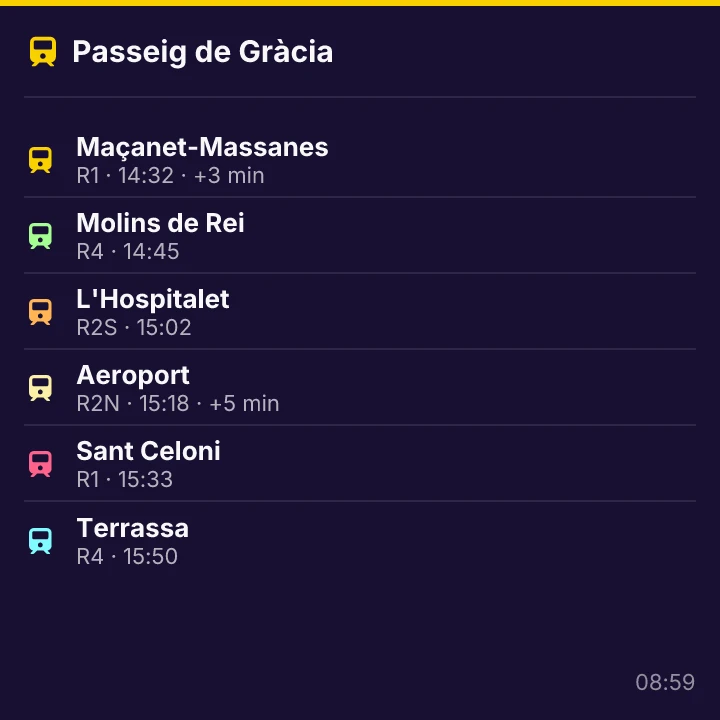 |
| Stocks | Hacker News | Departures |
| 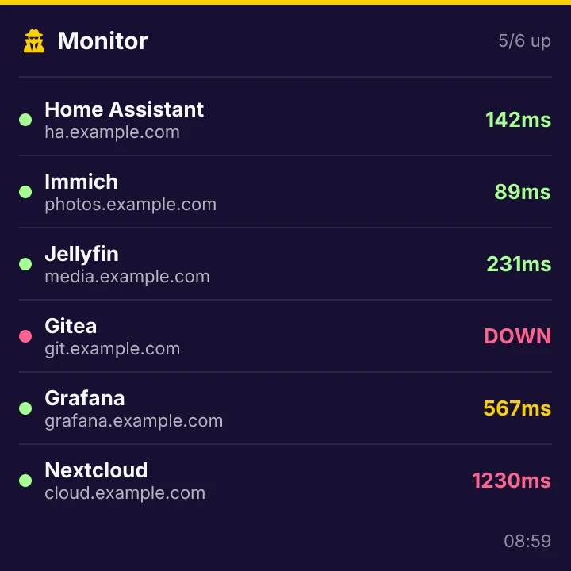 | 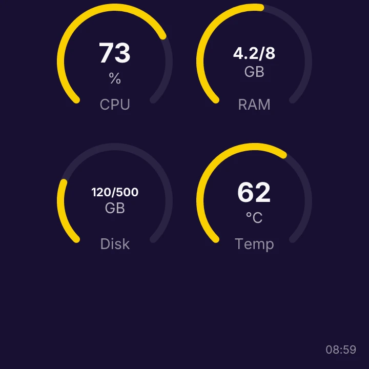 | 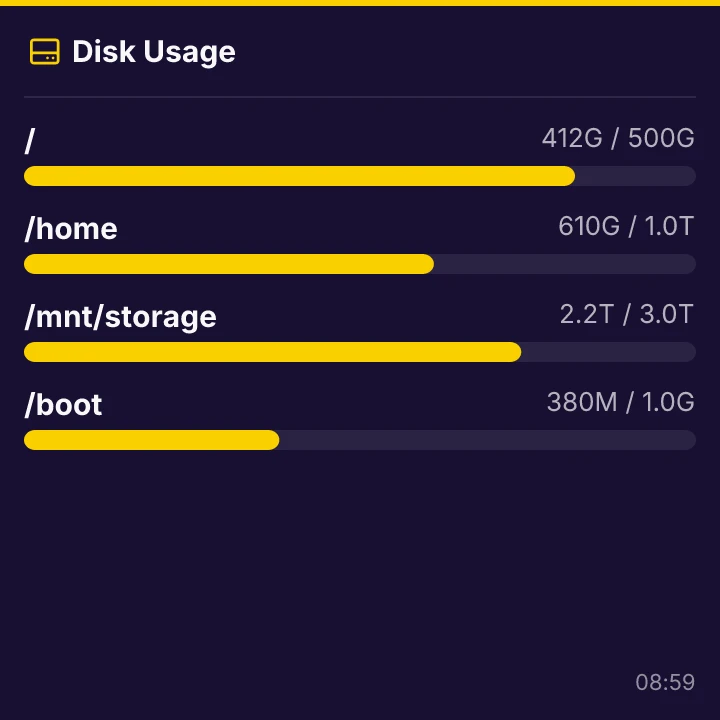 |
| Monitor | Gauge | Progress |
| 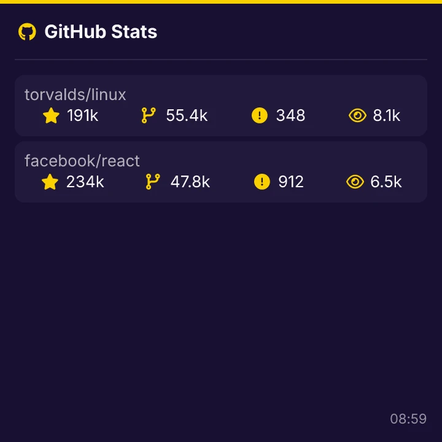 | 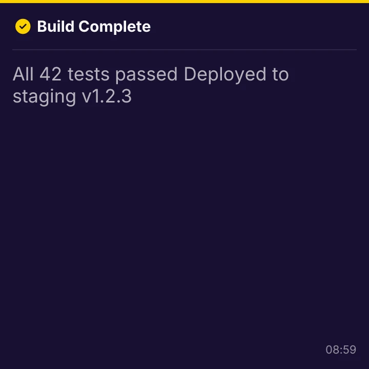 | 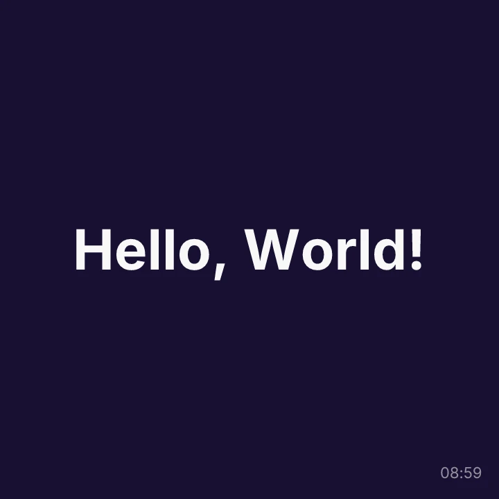 |
| GitHub | Notification | Message |
| 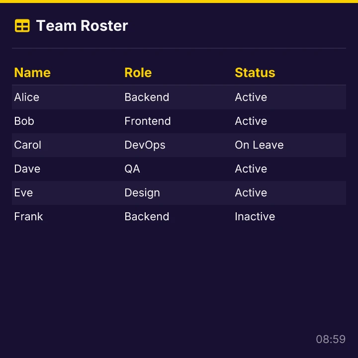 | 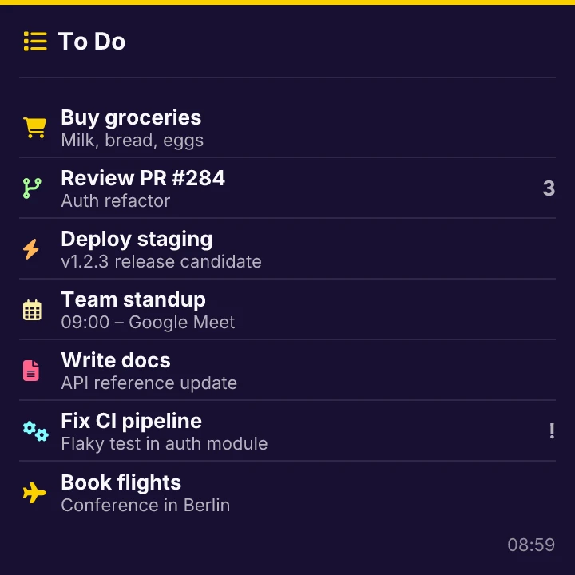 | 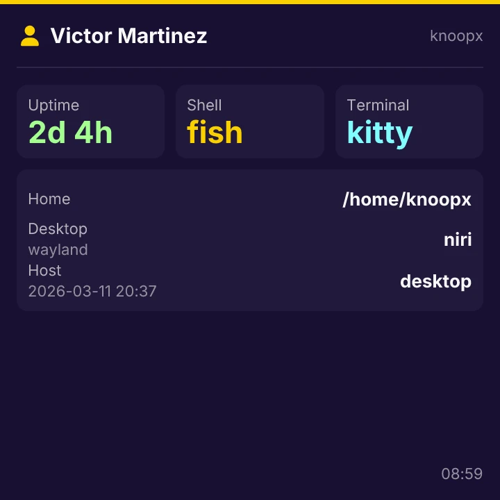 |
| Table | List | User |
| 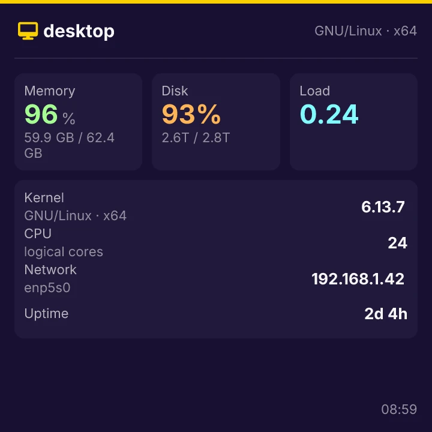 |  |  |
| System |  |  |

## How It Works

```
JSX / openui-lang      satori           resvg + sharp       UART
┌─────────────────┐  ┌───────────┐    ┌─────────────┐    ┌─────────┐
│ emit() or       │─→│ JSX → SVG │───→│ PNG → WebP  │───→│ chunked │
│ parser.parse()  │  │ (yoga)    │    │ (rotate)    │    │ serial  │
└─────────────────┘  └───────────┘    └─────────────┘    └─────────┘
```

1. **Write UI** as JSX (using the component library) or openui-lang text
2. **Emit** JSX to openui-lang via `emit()`, or feed text directly to the parser
3. **satori** renders the component tree to SVG using yoga layout
4. **resvg + sharp** convert to WebP, rotated 180° for the display orientation
5. The frame is sent over **serial** using the DWBP chunked protocol

For LLM-driven UIs, the CLI generates a **system prompt** from the component library that instructs the model to output valid openui-lang.

## Component Library

| Component | Description |
|-----------|-------------|
| `Canvas` | 720×720 root container (required) |
| `Header` | Accent bar + icon + title |
| `Content` | Padded content area below header |
| `Stack` | Flex container (row/column, gap, wrap) |
| `Alert` | Emphasized callout with icon and message |
| `EmptyState` | Centered no-data / fallback state |
| `Card` | Elevated card with subtle background |
| `Text` | Text block with size/weight/color |
| `Icon` | Nerd Font glyph |
| `Badge` | Colored pill label |
| `KeyValue` | Compact label-value row |
| `Stat` | KPI / metric card |
| `Separator` | Horizontal divider |
| `Spacer` | Flexible space filler |
| `Table` / `Col` | Data table with headers |
| `List` / `ListItem` | Vertical list with icons |
| `Gauge` | Circular arc gauge |
| `ProgressBar` | Horizontal progress bar |
| `Sparkline` | Mini line chart |
| `StatusDot` | Green/red status indicator |
| `Timestamp` | Auto-updating time display |

## Usage

### CLI

```bash
# Pipe openui-lang to the display
bun run examples/clock.tsx | waveshare-genui -

# Render to PNG instead
bun run examples/stocks.tsx AAPL MSFT | waveshare-genui - -o stocks.png

# Read a .oui file
waveshare-genui dashboard.oui

# Print the LLM system prompt
waveshare-genui prompt

# Print the JSON schema
waveshare-genui schema

# Display power
waveshare-genui on
waveshare-genui off
```

### JSX Emitter

Write UIs as typed JSX and emit openui-lang:

```tsx
import React from "react";
import { emit } from "./src/emit";
import { Canvas, Header, Content, List, ListItem, Timestamp } from "./src/library";

emit(
  <Canvas>
    <Header icon={"\uf201"} title="Market" />
    <Content>
      <List>
        <ListItem text="AAPL" secondary="$178.52" icon={"\uf201"} />
        <ListItem text="MSFT" secondary="$415.80" icon={"\uf201"} />
      </List>
    </Content>
    <Timestamp />
  </Canvas>,
);
```

### openui-lang Syntax

```
root = Canvas([header, content, ts])
header = Header("\uf201", "Market")
content = Content([card1, card2], 14)
card1 = Card([row1, spark1])
row1 = Stack([sym, price], "row", "s", "center", "between")
sym = Text("AAPL", "md", "bold", "muted")
price = Text("$178.52", "lg", "bold")
spark1 = Sparkline([170, 172, 175, 173, 178], "green")
card2 = Card([Text("MSFT — $415.80", "lg", "bold")])
ts = Timestamp()
```

## Examples

Production-ready scripts that fetch live data and output openui-lang to stdout:

| Example | Usage | Data Source |
|---------|-------|-------------|
| `clock.tsx` | `[--12h]` | System clock |
| `message.tsx` | `<text>` or `--stdin` | CLI argument |
| `notify.tsx` | `<title> [body] [--icon]` | CLI arguments |
| `calendar.tsx` | `[--max N] [--today]` | Google Calendar via gog |
| `tasks.tsx` | `[--list-id ID] [--max N]` | Google Tasks via gog |
| `departures.tsx` | `--station-id ID [--station NAME]` | Rodalies API |
| `stocks.tsx` | `AAPL MSFT BTC-USD` | Yahoo Finance |
| `github.tsx` | `owner/repo [...]` | GitHub API |
| `hackernews.tsx` | `[--count N]` | Hacker News API |
| `monitor.tsx` | `-s "Name=url" [...]` | Live HTTP checks |
| `gauge.tsx` | `[-g "Label:val:max:unit"]` | System stats or custom |
| `progress.tsx` | `[-i "Label:val:max"]` | Disk usage or custom |
| `table.tsx` | `[--json] [--stdin]` | Process list or custom |
| `list.tsx` | `[-i "text:detail"] [--json]` | Nix profile or custom |
| `user.tsx` | | Current logged-in user + session |
| `system.tsx` | | Live system information summary |

```bash
# Live stock ticker on display
bun run examples/stocks.tsx AAPL MSFT BTC-USD | waveshare-genui -

# Train departures
bun run examples/departures.tsx --station-id 78805 --station "Passeig de Gràcia" | waveshare-genui -

# Site monitoring
bun run examples/monitor.tsx -s "GitHub=https://github.com" -s "Google=https://google.com" | waveshare-genui -
```

## Architecture

```
genui/
  src/
    library.tsx     Component definitions (schema + renderer)
    emit.tsx        JSX → openui-lang emitter
    openui.tsx      openui-lang → React element parser
    tokens.ts       Design tokens (spacing, colors, fonts)
    theme.ts        Base16 theme loading
    render.ts       satori → resvg → sharp pipeline
    display.ts      Serial protocol (DWBP chunked)
    index.tsx       CLI entry point
  examples/
    *.tsx           Production scripts (live data, CLI args)
  scripts/
    screenshots.tsx  Render mock JSX to PNG (deterministic)
```

## Protocol

WebP frames over UART at 921600 baud:

```
Header: "DWBP" (4B) + length (u32 LE) + chunk_size (u16 LE) + reserved (u16)
Flow:   header → ACK → [chunk → ACK]... → done ACK
```

## Build

```bash
# Firmware
nix develop path:. --command make flash

# Host CLI
cd genui && bun install

# Screenshots (mock data, no network)
cd genui && bun run screenshots
```

## License

MIT
